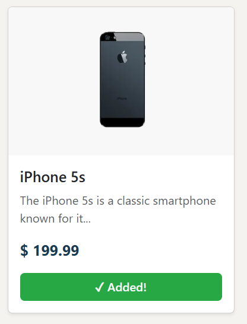
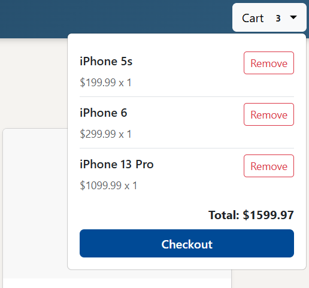
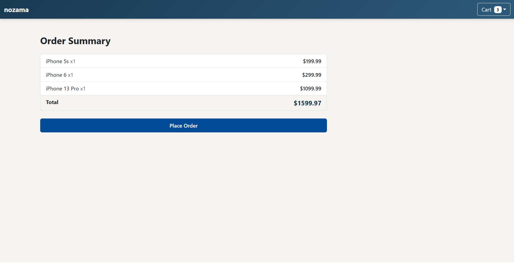
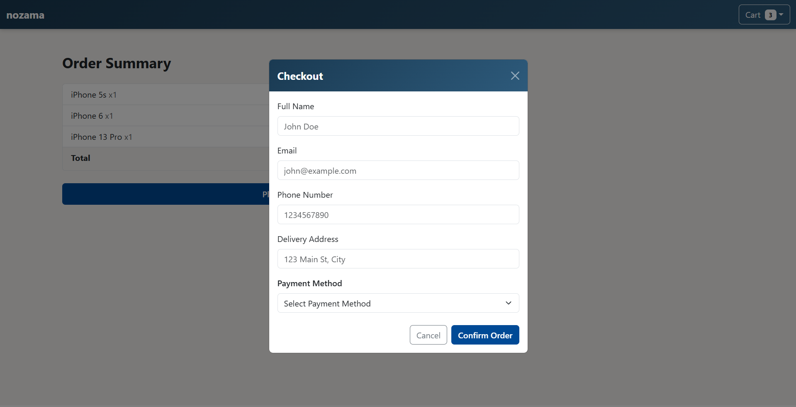
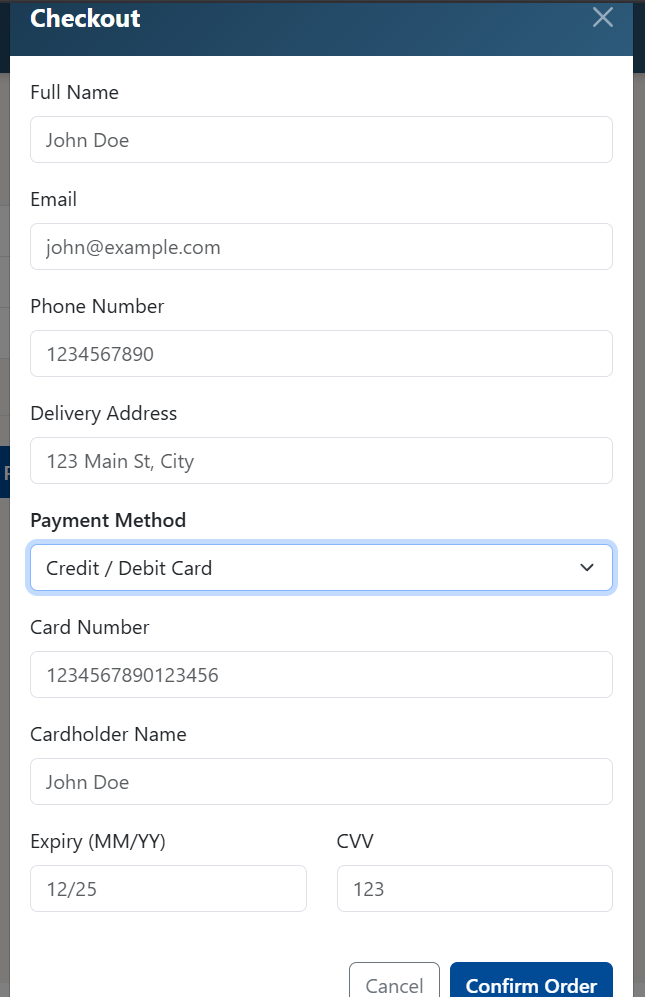
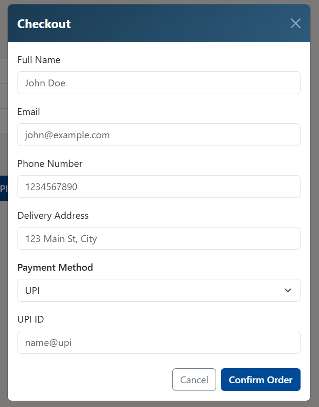
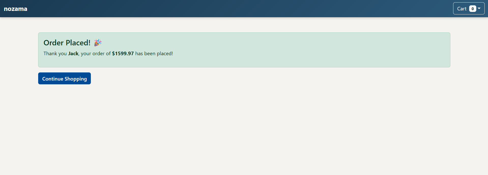

<div align="center">

## Nozamo Ecommerce App

<p><strong>React | Bootstrap 5 | React Router | Context API | DummyJSON API</strong></p>

<p>A polished ecommerce frontend project with responsive product browsing, cart management, and a validated checkout flow.</p>

</div>

<div style="page-break-after: always;"></div>

## Project Overview

Ecommerce App is a React-based single-page e-commerce demonstration built with Vite, Bootstrap 5, React Router, and the React Context API. The application pulls live product data from DummyJSON, presents it in a responsive storefront, supports cart management, and includes a complete checkout flow with validation and conditional payment fields.

The project was designed as a polished demo application with a consistent visual language, full-width layout coverage, and a professional checkout experience suitable for presentation.

## Key Objectives

- Build a responsive product storefront with real product data.
- Provide a simple cart flow with add, remove, and total calculation behavior.
- Implement a structured checkout form with validation.
- Keep the UI consistent with Bootstrap-based components and a beige page background.
- Present the project as a clean demo-ready frontend application.

## Tech Stack

| Technology | Purpose |
|---|---|
| React | Component-based UI development |
| Vite | Fast development server and build tooling |
| React Router DOM | Client-side routing between pages |
| React Context API | Global cart state management |
| Bootstrap 5 | Layout, forms, buttons, dropdowns, modal styling |
| DummyJSON API | Product data source |

## Application Structure

```
src/
├── assets/
│   ├── cart-items.png
│   ├── cart-summary.png
│   ├── checkout-page-bankcard.png
│   ├── checkout-page-cod.png
│   ├── checkout-page-form validation.png
│   ├── checkout-page-upi.png
│   ├── home page.png
│   ├── item-added.png
│   └── order-placed.png
├── components/
│   ├── Navbar.jsx
│   ├── ProductList.jsx
│   ├── Checkout.jsx
│   └── Modal.jsx
├── context/
│   └── CartContext.jsx
├── App.jsx
├── main.jsx
└── index.css
```

## HTML Structure Used

The app uses a very small HTML shell in `index.html`. React mounts into the `root` element, while `main.jsx` loads the application bundle and Bootstrap styles. This structure keeps the page lightweight and lets React control the full interface.

```html
<!doctype html>
<html lang="en">
	<head>
		<meta charset="UTF-8" />
		<meta name="viewport" content="width=device-width, initial-scale=1.0" />
		<title>ecommerce-app</title>
	</head>
	<body>
		<div id="root"></div>
		<script type="module" src="/src/main.jsx"></script>
	</body>
</html>
```

## Custom CSS Used

The project uses a small custom stylesheet in `index.css` for the global background and shared theme variables. Bootstrap handles most UI styling, while these variables keep the page colors consistent across components.

```css
:root {
	--navy-blue: #1a3a52;
	--navy-gradient: linear-gradient(135deg, #1a3a52 0%, #2d5a7b 100%);
	--button-color: #004a96;
	--light-beige: #f5f3f0;
}

body {
	background-color: var(--light-beige);
}
```

## Bootstrap Used

Bootstrap is the main UI framework for layout, responsive behavior, and form styling. The app uses Bootstrap grid classes for the product cards, flex utilities for alignment, and form and button classes for the checkout flow.

```jsx
<div className="row row-cols-1 row-cols-sm-2 row-cols-lg-3 row-cols-xl-4 g-4">
  <div className="col">
    <div className="card h-100 shadow-sm">
      ...
    </div>
  </div>
</div>
```

**Important Bootstrap classes used**

| Class | Purpose |
|---|---|
| `container-fluid` | Full-width page sections |
| `container` | Centered inner content |
| `row` | Grid row layout |
| `col`, `col-lg-8` | Responsive column sizing |
| `row-cols-1 row-cols-sm-2 row-cols-lg-3 row-cols-xl-4` | Responsive product grid |
| `g-4` | Spacing between grid items |
| `d-flex` | Flexbox alignment |
| `justify-content-between` | Space between list item content |
| `align-items-start` | Align cart item content at the top |
| `w-100` | Full width buttons |
| `mb-3`, `mb-4`, `mt-3`, `py-5` | Spacing helpers |
| `card`, `card-body`, `card-img-top` | Product card layout |
| `list-group`, `list-group-item` | Cart and summary lists |
| `form-control`, `form-select`, `form-label` | Checkout form fields and labels |
| `modal`, `modal-dialog`, `modal-content`, `modal-header`, `modal-body`, `modal-footer` | Checkout form popup layout |
| `btn`, `btn-outline-secondary`, `btn-close` | Buttons and modal close control |
| `dropdown`, `dropdown-menu`, `dropdown-toggle` | Cart dropdown |
| `alert`, `badge`, `text-muted`, `fw-bold` | Messaging and typography |

### Checkout Form Handling with Bootstrap

The checkout form uses Bootstrap form classes for every input, while React state handles the actual values and validation messages. This keeps the form visually consistent and fully controlled.

```jsx
<input
	className="form-control"
	placeholder="John Doe"
	value={form.name}
	onChange={(e) => setForm({ ...form, name: e.target.value })}
/>

<select
	className="form-select"
	value={form.payment}
	onChange={(e) => setForm({ ...form, payment: e.target.value })}
>
```

**Form behavior used in the checkout page**

| Form Feature | Purpose |
|---|---|
| `form-control` inputs | Styled text fields for name, email, phone, address, card details, and UPI ID |
| `form-select` | Payment method dropdown |
| `form-label` | Labels above each input |
| `d-flex gap-2 justify-content-end` | Aligns action buttons in the modal footer |
| `text-danger small` | Displays validation errors clearly under inputs |
| `modal` classes | Keeps the checkout form centered and readable |

## JavaScript Concepts Used

The project uses important React and JavaScript concepts such as hooks, event handling, async data fetching, conditional rendering, and array methods. These are the main logic patterns behind the app.

### useState

Used to store local component state like products, cart feedback, checkout form values, and modal visibility.

```jsx
const [products, setProducts] = useState([])
const [addedId, setAddedId] = useState(null)
```

### useEffect and async fetching

Used in `ProductList.jsx` to fetch products after the component loads.

```jsx
useEffect(() => {
	const fetchProducts = async () => {
		const [res1, res2, res3] = await Promise.all([
			fetch("https://dummyjson.com/products/category/smartphones"),
			fetch("https://dummyjson.com/products/category/laptops"),
			fetch("https://dummyjson.com/products/category/sports-accessories")
		])
		const data1 = await res1.json()
		const data2 = await res2.json()
		const data3 = await res3.json()
		setProducts([...data1.products, ...data2.products, ...data3.products])
	}
	fetchProducts()
}, [])
```

### Event handling

Used for button clicks, input changes, and submit actions. This is how the app responds to user interaction.

```jsx
<button onClick={() => handleAddToCart(product)}>Add to Cart</button>

<input
  className="form-control"
  value={form.name}
  onChange={(e) => setForm({ ...form, name: e.target.value })}
 />
```

### Conditional rendering

Used to show different UI states like cart empty, order success, card payment fields, and UPI fields.

```jsx
{form.payment === "card" && (
	<div>
		...
	</div>
)}
```

### Array methods

Used to render lists and calculate totals.

```jsx
const itemCount = cart.reduce((sum, item) => sum + item.quantity, 0)

{products.map((product) => (
	<div key={product.id} className="col">
		...
	</div>
))}
```

## Features

- Responsive product grid with product cards.
- Cart dropdown in the navbar with live totals.
- Add-to-cart feedback state on product buttons.
- Checkout page with dynamic payment sections.
- Inline validation for all required fields.
- Order success state after confirmation.

## Components Used

### `main.jsx`

`main.jsx` is the application entry point. It imports Bootstrap, loads the shared global styles, and renders the app inside the root DOM node. It also wraps the app with `CartProvider` so cart state is available throughout the component tree.

```jsx
createRoot(document.getElementById("root")).render(
	<CartProvider>
		<App />
	</CartProvider>
)
```

### `App.jsx`

`App.jsx` defines the top-level routing and app layout. It uses `BrowserRouter` and `Routes` to switch between the product listing page and checkout page. The navbar stays visible across all routes.

```jsx
<BrowserRouter>
	<Navbar />
	<Routes>
		<Route path="/" element={<ProductList />} />
		<Route path="/checkout" element={<Checkout />} />
	</Routes>
</BrowserRouter>
```

### `CartContext.jsx`

`CartContext.jsx` stores the application cart state in a global context. It provides `cart`, `addToCart`, `removeFromCart`, `clearCart`, and `total` through the `useCart()` hook. This prevents prop drilling and keeps cart logic centralized.

```jsx
const CartContext = createContext()

export function CartProvider({ children }) {
	const [cart, setCart] = useState([])

	return (
		<CartContext.Provider value={{ cart, setCart }}>
			{children}
		</CartContext.Provider>
	)
}

export function useCart() {
	return useContext(CartContext)
}
```

### `Navbar.jsx`

`Navbar.jsx` is the persistent top navigation bar. It shows the store name, cart item count, a dropdown listing cart items, item removal actions, cart total, and a checkout button. The navbar uses a navy gradient to distinguish it from the page background and content sections.

```jsx
const itemCount = cart.reduce((sum, item) => sum + item.quantity, 0)

<button onClick={() => navigate("/checkout")}>Proceed to Checkout</button>
```

### `ProductList.jsx`

`ProductList.jsx` fetches products from three DummyJSON endpoints in parallel using `Promise.all`, combines the results, and renders the products as Bootstrap cards. Each product card includes an image, title, description snippet, price, and an Add to Cart button. The button changes state briefly after click to confirm the action.

```jsx
useEffect(() => {
	const fetchProducts = async () => {
		const [res1, res2, res3] = await Promise.all([
			fetch("https://dummyjson.com/products/category/smartphones"),
			fetch("https://dummyjson.com/products/category/laptops"),
			fetch("https://dummyjson.com/products/category/sports-accessories")
		])
		const data1 = await res1.json()
		const data2 = await res2.json()
		const data3 = await res3.json()
		setProducts([...data1.products, ...data2.products, ...data3.products])
	}
	fetchProducts()
}, [])
```

### `Checkout.jsx`

`Checkout.jsx` handles the complete checkout workflow. It shows the order summary, calculates totals, opens the modal, validates form input, and supports multiple payment methods. Depending on the chosen payment option, it conditionally renders card or UPI fields. After successful submission, it clears the cart and displays an order confirmation message.

```jsx
const validate = () => {
	const newErrors = {}
	if (!form.name.trim()) newErrors.name = "Name is required"
	if (!form.payment) newErrors.payment = "Please select a payment method"
	return newErrors
}
```

### `Modal.jsx`

`Modal.jsx` is a reusable wrapper for modal content. It receives `children` and `onClose` as props and renders a Bootstrap-based overlay with a centered dialog. This keeps the checkout form structure separate from the checkout page logic.

```jsx
<div className="modal show d-block">
	<div className="modal-dialog modal-dialog-centered">
		<div className="modal-content">{children}</div>
	</div>
</div>
```

## State and Data Flow

| State / Value | Location | Purpose |
|---|---|---|
| `cart` | `CartContext.jsx` | Holds selected products and quantities |
| `total` | `CartContext.jsx` | Stores the cart total amount |
| `addedId` | `ProductList.jsx` | Tracks which button was clicked for visual feedback |
| `form` | `Checkout.jsx` | Stores checkout form field values |
| `errors` | `Checkout.jsx` | Stores validation messages |
| `ordered` | `Checkout.jsx` | Toggles the order success screen |
| `showModal` | `Checkout.jsx` | Controls checkout modal visibility |
| `finalTotal` | `Checkout.jsx` | Preserves cart total after checkout submission |

## Routing

| Path | Component | Purpose |
|---|---|---|
| `/` | `ProductList` | Product listing page |
| `/checkout` | `Checkout` | Checkout and order summary page |

The navbar remains outside the route switch so it is present on every screen.

## API Integration

The application uses the DummyJSON API to load products from multiple categories.

**Endpoints used**

| Endpoint | Category |
|---|---|
| `https://dummyjson.com/products/category/smartphones` | Smartphones |
| `https://dummyjson.com/products/category/laptops` | Laptops |
| `https://dummyjson.com/products/category/sports-accessories` | Sports accessories |

The app merges all returned arrays into one product list for the storefront.

## Validation Rules

| Field | Rule |
|---|---|
| Full Name | Required |
| Email | Required and must match email format |
| Phone Number | Required and must be exactly 10 digits |
| Delivery Address | Required |
| Payment Method | Required |
| Card Number | Required for card payments and must be 16 digits |
| Cardholder Name | Required for card payments |
| Expiry | Required for card payments in `MM/YY` format |
| CVV | Required for card payments and must be 3 digits |
| UPI ID | Required for UPI payments and must match `name@upi` format |

## Output

This section captures the final application output using the images stored in `src/assets`.

### Home Page


### Cart Item Added State



### Cart Items View



### Cart Summary



### Checkout Page - Cash on Delivery



### Checkout Page - Card Payment



### Checkout Page - UPI Payment



### Checkout Form Validation


### Order Placed Screen



## Bootstrap Reference Used in the Project

| Class | Usage |
|---|---|
| `container-fluid` | Full-width page sections |
| `container` | Centered content blocks |
| `row` | Grid layout row |
| `col-lg-8` | Checkout content width |
| `card` | Product cards |
| `list-group` | Cart and order summary lists |
| `dropdown-menu` | Cart dropdown panel |
| `form-control` | Input fields |
| `form-select` | Payment method selector |
| `modal` | Checkout popup |
| `btn` | Action buttons |
| `badge` | Cart item count |
| `alert` | Success message |

## Summary

Nozamo Ecommerce App is a Bootstrap-based React storefront that demonstrates a complete ecommerce flow from product browsing to order confirmation. The project includes responsive product cards, a cart dropdown, a checkout form with conditional payment fields, and validation logic to support a realistic user experience.

## Conclusion

This project successfully combines React, React Router, React Context API, and Bootstrap 5 to deliver a clean and organized frontend application. It shows practical use of component-driven design, shared state management, API integration, and form handling in a polished ecommerce interface.
